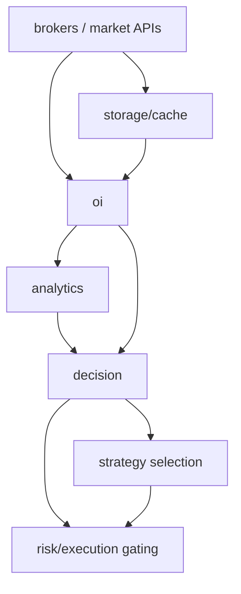
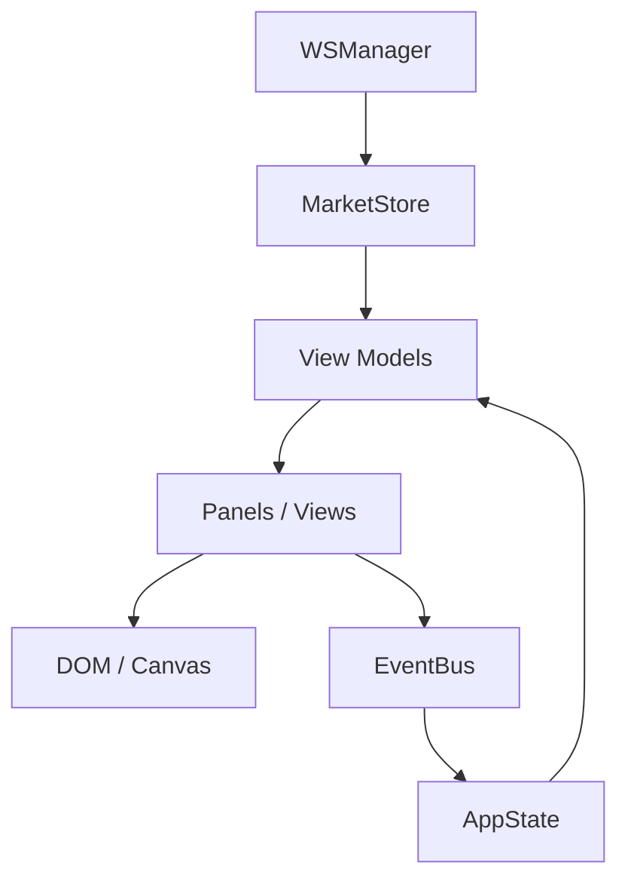

# Dependency Graph

> **Product:** mTerminals  
> **Architecture baseline:** 2026-08-07 project snapshot  
> **Status:** Authoritative design target unless marked otherwise  
> **Rule language:** SHALL = required; SHOULD = recommended; MAY = optional.

## Backend target dependency direction

Infrastructure MAY be consumed by multiple layers, but reverse dependencies
such as `storage → decision` are prohibited.

## Frontend target dependency direction

Events do not replace MarketStore.

## Architectural smell checks

Flag any new dependency where:
- broker imports strategy;
- storage imports decision;
- risk is used as a calculator by UI;
- a card imports another card only to read a value;
- template code computes a business metric that already exists in backend/domain logic.
