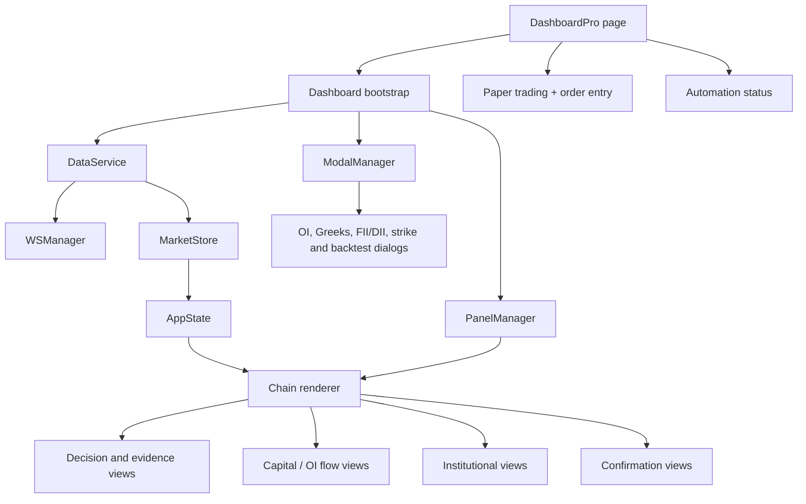

# Component Tree

> **Architecture baseline:** 2026-08-08 implementation
> **Status:** Implemented and CI-enforced

The tree shows runtime ownership, not DOM nesting. `EventBus` carries semantic
notifications beside this tree; it does not replace `MarketStore`.
