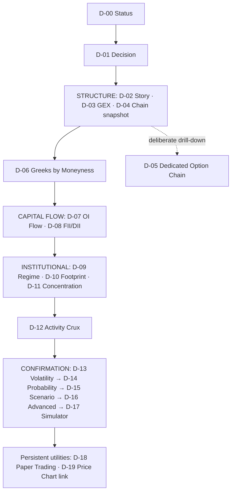

# Dashboard Layout

> **Architecture baseline:** 2026-08-08 implementation
> **Status:** Implemented and CI-enforced

Runtime values do not reorder zones or cards. Below desktop width the same
reading order stacks vertically; compact mode does not hide required content.
