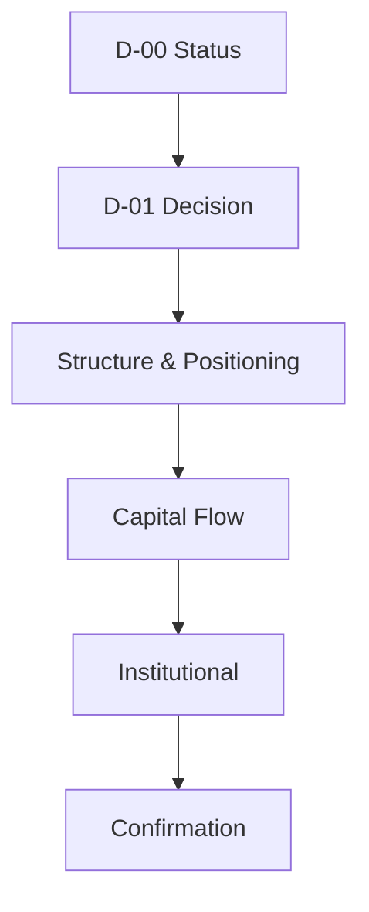

# Dashboard Layout

> **Product:** mTerminals  
> **Architecture baseline:** 2026-08-07 project snapshot  
> **Status:** Authoritative design target unless marked otherwise  
> **Rule language:** SHALL = required; SHOULD = recommended; MAY = optional.

Desktop executive rows: `D-02/D-03/D-04`, `D-07/D-08`, `D-09/D-10/D-11`, then `D-12`.
