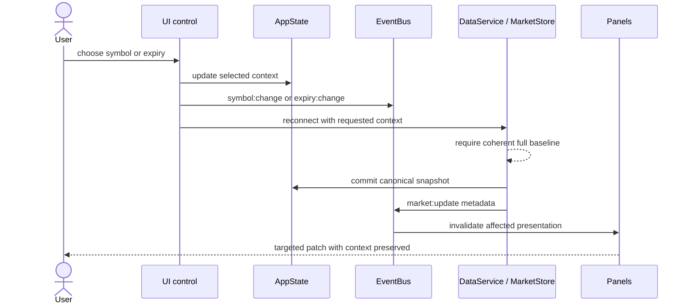

# Event Flow

> **Architecture baseline:** 2026-08-08 implementation
> **Status:** Implemented and CI-enforced

Navigation and modal events carry identifiers only. Market snapshots stay in
the canonical store rather than event payloads.
