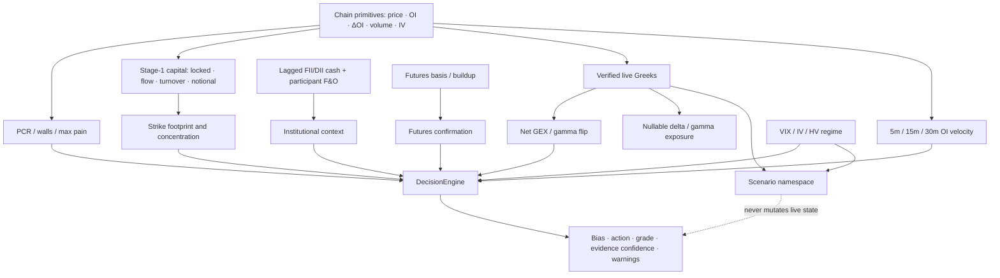

# Metric Dependency

> **Architecture baseline:** 2026-08-08 implementation
> **Status:** Implemented and CI-enforced

Arrows mean calculation dependency, not visual duplication. Canonical owners
compute each shared metric once; views format and explain those values.
