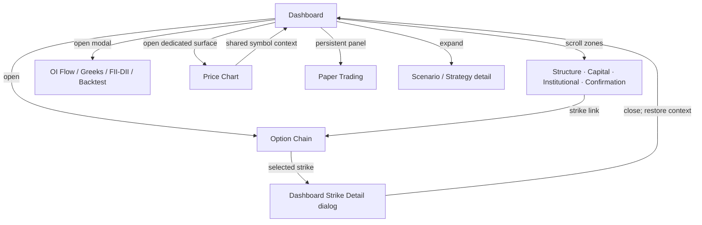

# Navigation Flow

> **Architecture baseline:** 2026-08-08 implementation
> **Status:** Implemented and CI-enforced

Symbol and expiry context propagate explicitly. Back/close actions restore the
invoker, selected strike, scroll position and active market context.
