# Rendering Pipeline

> **Architecture baseline:** 2026-08-08 implementation
> **Status:** Implemented and CI-enforced

```mermaid
flowchart LR
  MSG["Full / delta message"] --> VERIFY{"Compatible baseline?"}
  VERIFY -- "No" --> RECOVER["RECOVERING + request full snapshot"]
  VERIFY -- "Yes" --> MERGE["MarketStore canonical merge"]
  MERGE --> KEYS["Changed keys and feed metadata"]
  KEYS --> VM["Pure formatting / view models"]
  VM --> PATCH{"Structure changed?"}
  PATCH -- "No" --> FIELD["Targeted text, class and attribute patches"]
  PATCH -- "Yes" --> SUBTREE["Guarded subtree replacement"]
  KEYS --> CHART{"Relevant chart key changed?"}
  CHART -- "Yes" --> DRAW["Scheduled canvas redraw"]
  FIELD --> PRESERVE["Preserve focus, scroll, open dialogs and drag state"]
  SUBTREE --> PRESERVE
  DRAW --> PRESERVE
```

Whole-page replacement is not part of the live path. Structural replacements
must use the interaction guards documented in the rendering architecture.
