# Feed State Diagram

> **Architecture baseline:** 2026-08-08 implementation
> **Status:** Implemented and CI-enforced

```mermaid
stateDiagram-v2
  [*] --> Connecting
  Connecting --> Recovering: socket opens; awaiting data
  Connecting --> Disconnected: connection fails
  Recovering --> Live: coherent full or compatible message
  Recovering --> Disconnected: socket closes
  Live --> Live: compatible delta
  Live --> Partial: required fields missing
  Partial --> Live: complete canonical update
  Live --> Stale: freshness threshold exceeded
  Partial --> Stale: freshness threshold exceeded
  Stale --> Live: fresh compatible update
  Stale --> Disconnected: socket closes
  Disconnected --> Connecting: delayed reconnect
  Live --> Recovering: baseline mismatch
  Partial --> Recovering: baseline mismatch
```

`MARKET_CLOSED` and `HOLIDAY` are session overlays, not transport states; they
may coexist with an online or offline socket and do not imply stale failure.
