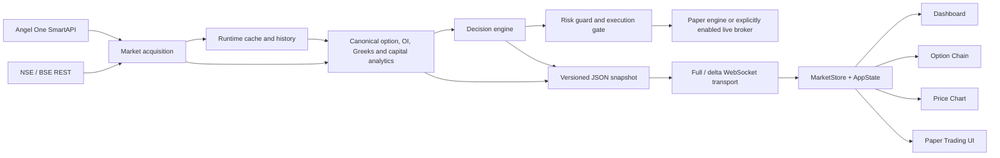

# System Overview

> **Architecture baseline:** 2026-08-08 implementation
> **Status:** Implemented and CI-enforced

Dependency direction is left to right. Presentation never calls acquisition or
domain modules directly; live execution remains behind risk and explicit mode
gates.
