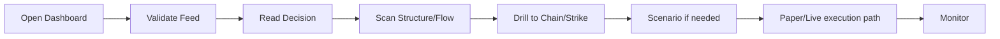

# Trader User Flow

> **Product:** mTerminals  
> **Architecture baseline:** 2026-08-07 project snapshot  
> **Status:** Authoritative design target unless marked otherwise  
> **Rule language:** SHALL = required; SHOULD = recommended; MAY = optional.

