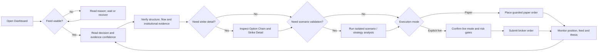

# Trader User Flow

> **Architecture baseline:** 2026-08-08 implementation
> **Status:** Implemented and CI-enforced

Degraded evidence disables execute-ready recommendations. Scenario results do
not overwrite the live decision baseline.
